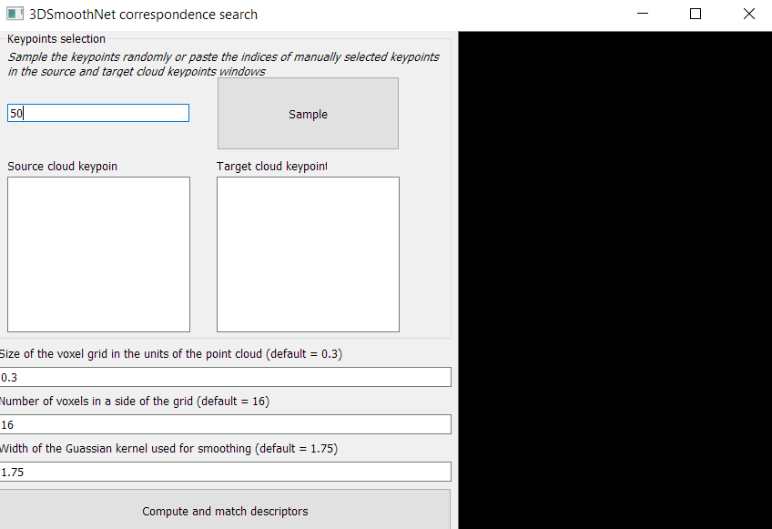

# GUI for TEASER++ and 3DSmoothNet
This fork provides a simple GUI for the original TEASER++ project (without PCL dependencies) and 3DSmoothNet descriptors (https://github.com/zgojcic/3DSmoothNet), as well as instructions on how
to compile TEASER++ and 3DSmoothNet for Windows. The GUI is written in Python using PyQT, so it can be run on Linux as well.  


*Main window of the GUI*


*3DSmoothNet correspondences search*
## About TEASER++

*Left: correspondences generated by [3DSmoothNet](https://github.com/zgojcic/3DSmoothNet) (green and red lines represent the inlier and outlier correspondences according to the ground truth respectively). Right: alignment estimated by TEASER++ (green dots represent inliers found by TEASER++).*

TEASER++ can solve the rigid body transformation problem between two point clouds in 3D. It performs well even if the input correspondences have an extremely large number of outliers. For a short conceptual introduction, check out our [video](https://www.youtube.com/watch?v=xib1RSUoeeQ). For more information, please refer to our papers:
- [H. Yang](http://hankyang.mit.edu/), [J. Shi](http://jingnanshi.com/), and [L. Carlone](http://lucacarlone.mit.edu/), "TEASER: Fast and Certifiable Point Cloud Registration,". [arXiv:2001.07715](https://arxiv.org/abs/2001.07715) [cs, math], Jan. 2020. ([pdf](https://arxiv.org/pdf/2001.07715.pdf))
- [H. Yang](http://hankyang.mit.edu/) and [L. Carlone](http://lucacarlone.mit.edu/), “A Polynomial-time Solution for Robust Registration with Extreme Outlier Rates,” in Robotics: Science and Systems (RSS), 2019. ([pdf](https://arxiv.org/pdf/1903.08588.pdf))

If you find this library helpful or use it in your projects, please cite:
```bibtex
@article{Yang20arXiv-TEASER,
    title={TEASER: Fast and Certifiable Point Cloud Registration},
    author={Yang, Heng and Shi, Jingnan and Carlone, Luca},
    year={2020},
    eprint={2001.07715},
    archivePrefix={arXiv},
    primaryClass={cs.RO},
    url = {https://github.com/MIT-SPARK/TEASER-plusplus},
    pdf = {https://arxiv.org/abs/2001.07715}
}
```

If you are interested in more works from us, please visit our lab page [here](http://web.mit.edu/sparklab/).

## About 3DSmoothNet

### The Perfect Match: 3D Point Cloud Matching with Smoothed Densities (CVPR 2019).
[PDF](https://arxiv.org/pdf/1811.06879.pdf) | [Group Page](http://www.gseg.igp.ethz.ch/)

*[Zan Gojcic](https://www.ethz.ch/content/specialinterest/baug/institute-igp/geosensors-and-engineering-geodesy/en/people/scientific-assistance/zan-gojcic.html), [Caifa Zhou](https://www.ethz.ch/content/specialinterest/baug/institute-igp/geosensors-and-engineering-geodesy/en/people/scientific-assistance/caifa-zhou.html), [Jan D. Wegner](http://www.prs.igp.ethz.ch/content/specialinterest/baug/institute-igp/photogrammetry-and-remote-sensing/en/group/people/person-detail.html?persid=186562), [Andreas Wieser](https://www.ethz.ch/content/specialinterest/baug/institute-igp/geosensors-and-engineering-geodesy/en/people/group-head/prof-dr--andreas-wieser.html)*

We propose 3DSmoothNet, a full workflow to match
3D point clouds with a siamese deep learning architecture
and fully convolutional layers using a voxelized smoothed
density value (SDV) representation. The latter is computed per interest point and aligned to the local reference frame (LRF) to achieve rotation invariance. Our compact, learned, rotation invariant 3D point cloud descriptor achieves 94.9% average recall on the 3DMatch benchmark data set, outperforming the state-of-the-art by more than 20 percent points with only 32 output dimensions. This very low output dimension allows for near realtime correspondence search with 0.1 ms per feature point on a standard PC. Our approach is sensor- and sceneagnostic because of SDV, LRF and learning highly descriptive features with fully convolutional layers. We show that 3DSmoothNet trained only on RGB-D indoor scenes
of buildings achieves 79.0% average recall on laser scans
of outdoor vegetation, more than double the performance of our closest, learning-based competitors.


`!` **Update**: We have submitted a revised version of the paper to Arxiv for correcting the typo.

### Citation

If you find this code useful for your work or use it in your project, please consider citing:

```shell
@inproceedings{gojcic20193DSmoothNet,
	title={The Perfect Match: 3D Point Cloud Matching with Smoothed Densities},
	author={Gojcic, Zan and Zhou, Caifa and Wegner, Jan Dirk and Wieser Andreas},
	booktitle={International conference on computer vision and pattern recognition (CVPR)},
	year={2019}
}
```

## Setup on Windows
### Using precompiled binaries

Requirements:
1. MinGW32 GCC == 9.2.0 (with mingw32-pthreads-w32-dev checked during installation) 
2. The latest vc_redist package
3. PCL == 1.10.1 (https://github.com/PointCloudLibrary/pcl/releases/tag/pcl-1.10.1)
4. CUDA Toolkit, NVIDIA GPU drivers, cuDNN SDK (to run 3DSmoothNet, for more information
refer to the tensorflow's installation manual https://www.tensorflow.org/install/gpu)

Python requirements:
1. Python == 3.7
2. PyQt == 5.12.3
3. numpy == 1.14.5
4. open3d == 0.10.0.1 (earlier versions might not work)
5. tensorboard == 1.14.0
6. tensorflow-gpu == 1.14.0
7. tqdm = 4.31.1

The GUI is written in Python, therefore does not require compilation. However, TEASER++ and the input 
parametrization of 3DSmoothNet are written in C++. This repository provides the respective binaries
compiled with Visual Studio 19 version 16.6.2 and GCC version 9.2.0 on Windows 10 for the 64-bit processor architecture.

In order to run the GUI using the pre-compiled binaries, one just has to setup the Python environment. For
this first clone the repository:

```shell
git clone https://github.com/superkirill/TEASER-GUI
```

Then create a conda environment / pip install the dependencies:

```shell
cd TEASER-GUI
conda env create --file environment.yml # For Anaconda
pip install -r requirements.txt         # For pip
```

After that the GUI can be run as:

```shell
cd GUI
conda activate teaser-gui # If using Anaconda
python run_GUI.py
```

Note that because the binaries were compiled with MSVC and GCC their dynamic libraries must be discoverable.
Make sure that *vc_redist* (Visual C++ redistributable package) as well as MinGW GCC are installed and
discoverable (add them to the system PATH variable). Finally, make sure that the Point Cloud Library (PCL)
is installed and discoverable.

### Building from sources

Requirements:
1. MinGW32 GCC == 9.2.0 (with mingw32-pthreads-w32-dev checked during installation) 
2. Microsoft Visual Studio 19 (to build 3DSmoothNet input parametrization block)
3. CMake >= 3.10
4. PCL == 1.10.1 (https://github.com/PointCloudLibrary/pcl/releases/tag/pcl-1.10.1)
5. CUDA Toolkit, NVIDIA GPU drivers, cuDNN SDK (to run 3DSmoothNet, for more information
refer to the tensorflow's installation manual https://www.tensorflow.org/install/gpu)

Building from sources requires the MinGW GCC compiler to build TEASER++.
 
First, download and install PCL, NVIDIA environment, CMake and Visual Studio.
After that build TEASER++ libraries and the module used by the GUI.


```shell
# Clone the repo
git clone https://github.com/superkirill/TEASER-GUI

# Configure and build TEASER++
cd TEASER-GUI
mkdir build
cd build
cmake -G "MinGW Makefiles" -DBUILD_WITH_MARCH_NATIVE=ON -DBUILD_TEASER_FPFH=OFF -DBUILD_PYTHON_BINDINGS=OFF ..
mingw32-make.exe # Make sure it can be found in the PATH system variable
cd ..

# Build the module used by the GUI
cd GUI
cmake -G "MinGW Makefiles" ..
mingw32-make.exe
```

To compile 3DSmoothNet's input parametrization block:

```shell
cd TEASER-GUI\smooth_net
mkdir build
cd build
cmake DCMAKE_BUILD_TYPE=Release ..
```

Then open the *3DSmoothNet.sln* with Visual Studio, right click on 3DSmoothNet in the solution
explorer and select *Build* to build the project.

Finally, compile the module used by the GUI:

```shell
cd TEASER-GUI
copy_dlls.bat # install the built libraries to run the modules used by the GUI
cd GUI
cmake -G "MinGW Makefiles" ..
mingw32-make.exe
```

## Usage

The main window of the GUI allows to run TEASER++ and view two point clouds, their initial and computed alignments.


#### Load data
In order to load point clouds click at "Point clouds" in the top bar menu, then "Load source cloud..." and
"Load target cloud...". This will open a file dialog in which the user should select a *.ply file representing
the point cloud to load.

#### Load correspondences
To run TEASER++ first generate or load the correspondences (pairs of indices of points in two point clouds). To
load correspondences from an existing file click at "Correspondences" -> "Load from file...". This will open
a file dialog in which the user should select a *.txt file containing correspondences in the following format:

```shell
point1_index_in_cloud1 point1_index_in_cloud2
point2_index_in_cloud1 point2_index_in_cloud2
...
pointN_index_in_cloud1 pointN_index_in_cloud2

```

#### Generate correspondences using 3DSmoothNet
To generate correspondences using 3DSmoothNet click at "Correspondences" -> "Compute with 3DSmoothNet...". This will open
the following window:



Here, the user can randomly sample the indices of points for which the descriptors will be computed, or
input them manually in the two text boxes: "Source cloud keypoints" and "Target cloud keypoints". Nore, that
the number of keypoints should be equal for both point clouds.

Finally, choose the size of the voxel grid, number of voxels in a side of the grid and the width of the 
Gaussian kernel for smoothing. The size of the voxel grid is given in the point cloud units and should be chosen so, that
the neighbourhood of each point contains at least 10 points. For more information, refer to the 
[3DSmoothNet paper](https://arxiv.org/pdf/1811.06879.pdf).

Once the settings are finalized, click at "Compute and match descriptors". This might take
some time (depending on the selected settings and the point clouds) and will generate a file:

**TEASER-GUI\GUI\smooth_net_correspondences.txt**

The sampled keypoints will be saved in the files:

**TEASER-GUI\GUI\temp_src_keypoints.txt**
**TEASER-GUI\GUI\temp_tgt_keypoints.txt**

The input parametrization will be saved in the directory:

**TEASER-GUI\GUI\sdv\\**

The generated descriptors (as *.npz numpy arrays and *.txt files) will be saved in the directory:

**TEASER-GUI\GUI\smooth_net_descriptors\32_dim\\**

#### Running TEASER++

Finally, to run TEASER++ click on the button Run TEASER++ in the main window, preliminarily modifying (if necessary) 
the respective settings. For more information regarding the meaning of TEASER's parameters refer to the [original
TEASER++ paper](https://arxiv.org/abs/2001.07715). Note, that noise_bound defines the expected level of noise
in the input point clouds. One can try changing the default value to achieve better alignment. 